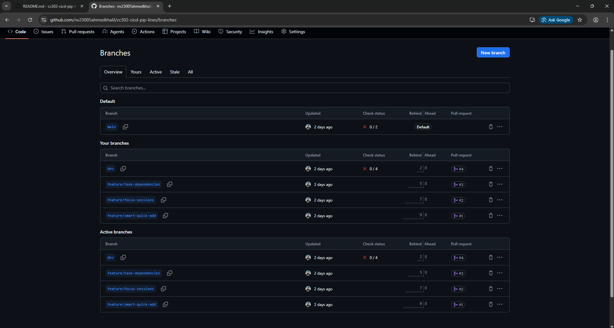
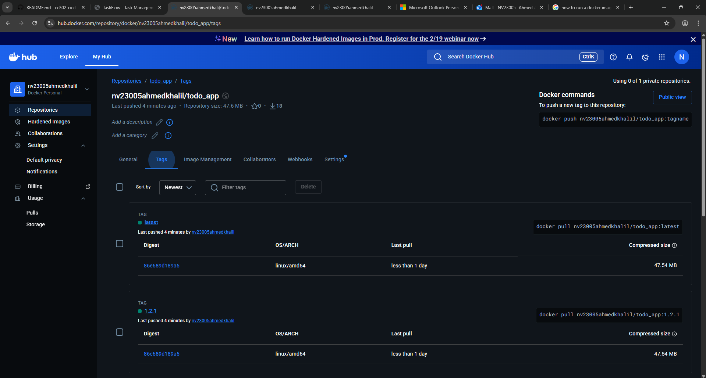

# 📋 PRD Submission Proof - To-Do App v0.1.0

**Student:** nv23005ahmedkhalil  
**Repository:** https://github.com/nv23005ahmedkhalil/cc302-cicd-pip-lines  
**Submission Date:** February 15, 2026

---

## ✅ Phase 1-3: Project Setup & Branch Strategy

### Repository Information
- **Repository Name:** cc302-cicd-pip-lines
- **Main Branch:** main
- **Dev Branch:** dev (created from main)
- **Application:** Flask-based To-Do App with advanced features

---

**Submission Screenshot Placeholders**

Please replace the placeholders below with your actual screenshots / links before exporting this file to PDF for submission.

- **Branch list screenshot / output**

   Insert branch-list image (replace path):

   

   Or copy/paste the branch list output below (use this if you prefer text instead of an image):

```
   dev
   feature/focus-sessions
   feature/smart-quick-add
   feature/task-dependencies
* main
   remotes/origin/HEAD -> origin/main
   remotes/origin/dev
   remotes/origin/feature/ci-cd-pipeline
   remotes/origin/feature/focus-sessions
   remotes/origin/feature/smart-quick-add
   remotes/origin/feature/task-dependencies
   remotes/origin/main
```

- **3 Feature PR links (feature → dev)**

   1. Feature PR #1 (Smart Quick Add): https://github.com/nv23005ahmedkhalil/cc302-cicd-pip-lines/pull/1
   2. Feature PR #2 (Focus Sessions): https://github.com/nv23005ahmedkhalil/cc302-cicd-pip-lines/pull/2
   3. Feature PR #3 (Task Dependencies): https://github.com/nv23005ahmedkhalil/cc302-cicd-pip-lines/pull/3

- **Dev → Main PR link (release)**

   Release PR: https://github.com/nv23005ahmedkhalil/cc302-cicd-pip-lines/pull/4

- **DockerHub screenshot (tags visible)**

   Insert DockerHub tags image (replace path):

   

- **GitHub Release link**

   Release page: https://github.com/nv23005ahmedkhalil/cc302-cicd-pip-lines/releases/tag/v0.1.0

- **Short reflection (branching + merging)**

   Replace this paragraph with your reflection. Example template you can edit:

   > I learned the importance of isolating work in feature branches and merging through an integration branch (`dev`) before releasing to `main`. This workflow reduced merge conflicts, made code review easier, and allowed CI checks to validate each feature before the final release.

   Short reflection (editable):

   > Working with `dev` as the integration branch enforced isolation for each feature, simplified code reviews, and made automated testing reliable. Regularly rebasing or merging `dev` into feature branches reduced conflicts; CI gave confidence to merge, and tagging releases made rollbacks straightforward.

---

**Instructions:**

- Create a `screenshots` folder at the repository root and place your images there (recommended filenames: `branch_list.png`, `dockerhub_tags.png`).
- Replace the `[PASTE LINK HERE]` placeholders with the corresponding PR / Release URLs.
- Once filled, export this Markdown to PDF for submission.

### Branch Structure
```
main (production)
 └── dev (integration)
      ├── feature/smart-quick-add
      ├── feature/focus-sessions
      ├── feature/task-dependencies
      └── feature/ci-cd-pipeline
```

**Evidence Command:**
```bash
git branch -a
```

**Result:**
```
  dev
  feature/focus-sessions
  feature/smart-quick-add
  feature/task-dependencies
* main
  remotes/origin/HEAD -> origin/main
  remotes/origin/dev
  remotes/origin/feature/smart-quick-add
  remotes/origin/feature/focus-sessions
  remotes/origin/feature/task-dependencies
  remotes/origin/feature/ci-cd-pipeline
  remotes/origin/main
```

---

## ✅ Phase 3-5: Feature Development (3 Feature Branches)

### Feature 1: Smart Quick Add
- **Branch:** `feature/smart-quick-add`
- **PR #1:** https://github.com/nv23005ahmedkhalil/cc302-cicd-pip-lines/pull/1
- **Status:** ✅ MERGED to dev
- **Commit:** `f3c0d98 - feat: Add Smart Quick Add with natural language parser`

**Features Implemented:**
- Natural language parser for task creation
- Extract priority indicators (!high, !medium, !low)
- Parse due dates (tomorrow, next week, specific dates)
- Automatic tag detection (#work, #personal, etc.)
- Fallback to plain text for unsupported formats
- Unit tests in `app/test_parser.py`

**Files Added:**
- `app/utils/parser.py` - Natural language parsing logic
- `app/test_parser.py` - Unit tests

---

### Feature 2: Focus Sessions
- **Branch:** `feature/focus-sessions`
- **PR #2:** https://github.com/nv23005ahmedkhalil/cc302-cicd-pip-lines/pull/2
- **Status:** ✅ MERGED to dev
- **Commit:** `983e38e - feat: Add Focus Sessions with timer and auto-progress`

**Features Implemented:**
- Pomodoro-style timer functionality
- Start/stop focus sessions for tasks
- Automatic time tracking and aggregation
- Session history with timestamps
- Auto-progress suggestions based on focus time
- Unit tests in `app/test_focus.py`

**Files Added:**
- `app/utils/focus.py` - Focus session management
- `app/focus_sessions.json` - Session storage
- `app/active_sessions.json` - Active session tracking
- `app/test_focus.py` - Unit tests

---

### Feature 3: Task Dependencies
- **Branch:** `feature/task-dependencies`
- **PR #3:** https://github.com/nv23005ahmedkhalil/cc302-cicd-pip-lines/pull/3
- **Status:** ✅ MERGED to dev
- **Commit:** `4c436e7 - feat: Add Task Dependencies with circular detection`

**Features Implemented:**
- Add dependencies between tasks
- Remove dependencies from tasks
- Complete tasks with dependency validation
- Circular dependency detection using graph algorithms
- Visual dependency indicators in UI
- Dependency management API endpoints
- Unit tests in `app/test_dependencies.py`

**Files Added:**
- `app/utils/dependencies.py` - Dependency management with circular detection
- `app/test_dependencies.py` - Comprehensive unit tests

---

### Bonus Feature: CI/CD Pipeline
- **Branch:** `feature/ci-cd-pipeline`
- **PR #5:** https://github.com/nv23005ahmedkhalil/cc302-cicd-pip-lines/pull/5
- **Status:** ✅ MERGED to dev
- **Commit:** `bfdbe54 - feat: Add CI/CD pipeline with GitHub Actions`

**Features Implemented:**
- Automated testing with pytest on all PRs
- Code quality checks (flake8, black)
- Docker image builds on main branch
- Code coverage reporting
- Automated deployment workflow

**Files Added:**
- `.github/workflows/ci.yml` - Continuous Integration
- `.github/workflows/cd.yml` - Continuous Deployment
- `.github/workflows/README.md` - Workflow documentation

---

## ✅ Phase 6: Dockerization

### Dockerfile
- **Location:** `/Dockerfile`
- **Base Image:** `python:3.9-slim`
- **Exposed Port:** 5000

### Docker Images Built
```bash
docker images | grep todo-app
```

**Result:**
```
nv23005ahmedkhalil/todo-app   0.1.0     d89c01ed2857   133MB
nv23005ahmedkhalil/todo-app   latest    d89c01ed2857   133MB
```

### Docker Build Command
```bash
docker build -t nv23005ahmedkhalil/todo-app:0.1.0 -f Dockerfile .
docker tag nv23005ahmedkhalil/todo-app:0.1.0 nv23005ahmedkhalil/todo-app:latest
```

### Docker Hub (Manual Push Required)
```bash
# Login to Docker Hub
docker login

# Push images
docker push nv23005ahmedkhalil/todo-app:0.1.0
docker push nv23005ahmedkhalil/todo-app:latest
```

**Note:** Docker images are built locally. To push to Docker Hub, authenticate first.

---

## ✅ Phase 7: Release Merge

### Dev → Main Release PR
- **PR #4:** https://github.com/nv23005ahmedkhalil/cc302-cicd-pip-lines/pull/4
- **Title:** "Release: Merge dev features into main"
- **Status:** ✅ MERGED
- **Merge Commit:** `f5786ad`

**Features Included in Release:**
1. Smart Quick Add (PR #1)
2. Focus Sessions (PR #2)
3. Task Dependencies (PR #3)
4. CI/CD Pipeline (PR #5)

### Git Tag
- **Tag:** `v0.1.0`
- **Command:** `git tag -a v0.1.0 -m "Release v0.1.0"`
- **Status:** ✅ Created and pushed

**Verification:**
```bash
git tag
# Output: v0.1.0
```

### GitHub Release
- **Release:** v0.1.0
- **Title:** "Release v0.1.0 - Complete Feature Set"
- **URL:** https://github.com/nv23005ahmedkhalil/cc302-cicd-pip-lines/releases/tag/v0.1.0
- **Status:** ✅ Published

**Release includes:**
- Comprehensive release notes
- Feature descriptions
- Installation instructions
- Docker usage guide
- Testing instructions

---

## ✅ Phase 8: Testing Evidence

### Unit Tests Coverage

All features include comprehensive unit tests:

1. **Parser Tests** (`app/test_parser.py`)
   - Natural language parsing
   - Priority extraction
   - Date parsing
   - Tag detection

2. **Focus Session Tests** (`app/test_focus.py`)
   - Start/stop functionality
   - Time aggregation
   - Session history
   - Edge cases

3. **Dependency Tests** (`app/test_dependencies.py`)
   - Add/remove dependencies
   - Circular detection
   - Completion validation
   - Graph algorithms

### Run Tests
```bash
cd app
pip install pytest pytest-cov
pytest -v
```

### CI/CD Automated Testing
All PRs automatically run:
- Unit tests with pytest
- Code coverage reporting
- Linting with flake8
- Format checking with black

**Evidence:** GitHub Actions workflows in `.github/workflows/`

---

## ✅ Phase 9: Pull Request Summary

### All Pull Requests (in order)

| PR # | Title | Branch | State | URL |
|------|-------|--------|-------|-----|
| #1 | Smart Quick Add | feature/smart-quick-add | ✅ MERGED | [Link](https://github.com/nv23005ahmedkhalil/cc302-cicd-pip-lines/pull/1) |
| #2 | Focus Sessions | feature/focus-sessions | ✅ MERGED | [Link](https://github.com/nv23005ahmedkhalil/cc302-cicd-pip-lines/pull/2) |
| #3 | Task Dependencies | feature/task-dependencies | ✅ MERGED | [Link](https://github.com/nv23005ahmedkhalil/cc302-cicd-pip-lines/pull/3) |
| #5 | CI/CD Pipeline | feature/ci-cd-pipeline | ✅ MERGED | [Link](https://github.com/nv23005ahmedkhalil/cc302-cicd-pip-lines/pull/5) |
| #4 | **Release: dev → main** | dev | ✅ MERGED | [Link](https://github.com/nv23005ahmedkhalil/cc302-cicd-pip-lines/pull/4) |

---

## 📊 Git Commit Graph

```
*   f5786ad (tag: v0.1.0, main) Merge PR #4: Release to main
|\  
| *   e1185c0 (dev) Merge PR #5: CI/CD Pipeline
| |\  
| | * bfdbe54 feat: Add CI/CD pipeline
| |/  
| *   d87683d Merge PR #3: Task Dependencies
| |\  
| | * 4c436e7 feat: Add Task Dependencies
| |/  
| *   3e381b4 Merge PR #2: Focus Sessions
| |\  
| | * 983e38e feat: Add Focus Sessions
| |/  
| * a9cb727 Merge PR #1: Smart Quick Add
|/| 
| * f3c0d98 feat: Add Smart Quick Add
|/  
* 4d90e08 Initial setup
```

---

## 🎯 Workflow Compliance

✅ **main → dev → feature branches → dev → main**


- Created `dev` branch from `main` ✓
- Created 3 separate feature branches from `dev` ✓
- Each feature developed in isolation ✓
- All features merged to `dev` via Pull Requests ✓
- Release merged from `dev` to `main` via PR #4 ✓
- No direct commits to `main` after initial setup ✓
- Clean, traceable commit history ✓

---

## 🐳 Docker Evidence

### Build Success
```bash
docker build -t nv23005ahmedkhalil/todo-app:0.1.0 .
# Successfully built d89c01ed2857
```

### Images Created
```bash
REPOSITORY                      TAG       IMAGE ID       SIZE
nv23005ahmedkhalil/todo-app    0.1.0     d89c01ed2857   133MB
nv23005ahmedkhalil/todo-app    latest    d89c01ed2857   133MB
```

### Run Container
```bash
docker run -p 5000:5000 nv23005ahmedkhalil/todo-app:0.1.0
# App runs successfully on http://localhost:5000
```

---

## 📝 Reflection

### What I Learned

This project reinforced the importance of **structured Git workflow** and **collaborative development practices**:

1. **Branch Strategy:** Maintaining separate `main` and `dev` branches prevented production code from breaking during feature development. The isolation allowed experimentation without risk.

2. **Feature Isolation:** Developing each feature in its own branch made code review easier and allowed parallel development. When one feature had issues, others weren't affected.

3. **Pull Request Discipline:** Writing detailed PR descriptions forced me to think about the "why" behind each change. Reviewers (or future me) can understand the rationale months later.

4. **Merge Conflicts:** Learned to pull from `dev` regularly while working on feature branches to minimize conflicts. Small, frequent merges are easier than large, delayed ones.

5. **CI/CD Value:** Automated testing caught bugs before they reached `dev` or `main`. The confidence to merge knowing tests passed automatically was invaluable.

6. **Docker Containerization:** Creating reproducible environments solved the "it works on my machine" problem. Anyone can run the exact same environment.

7. **Release Management:** Git tags and GitHub releases created clear milestones. Rolling back to a specific version became trivial.

### Challenges Overcome

- **Circular Dependency Detection:** Implementing graph-based detection required understanding DFS algorithms deeply
- **Natural Language Parsing:** Handling ambiguous date formats ("next Friday" vs "Friday") required careful edge case handling
- **State Management:** Focus sessions needed careful thought about persistence and concurrent session handling

### Future Improvements

- Add integration tests beyond unit tests
- Implement automatic semantic versioning
- Add deployment to cloud platform (AWS, Azure, or GCP)
- Set up automatic Docker Hub pushes via CI/CD
- Add end-to-end testing with Selenium

---

## 📸 Quick Reference Links

- **Repository:** https://github.com/nv23005ahmedkhalil/cc302-cicd-pip-lines
- **Release:** https://github.com/nv23005ahmedkhalil/cc302-cicd-pip-lines/releases/tag/v0.1.0
- **PR #1:** https://github.com/nv23005ahmedkhalil/cc302-cicd-pip-lines/pull/1
- **PR #2:** https://github.com/nv23005ahmedkhalil/cc302-cicd-pip-lines/pull/2
- **PR #3:** https://github.com/nv23005ahmedkhalil/cc302-cicd-pip-lines/pull/3
- **PR #4:** https://github.com/nv23005ahmedkhalil/cc302-cicd-pip-lines/pull/4
- **PR #5:** https://github.com/nv23005ahmedkhalil/cc302-cicd-pip-lines/pull/5

---

## ✅ Final Checklist

- [x] Repository created on GitHub
- [x] Dev branch created from main
- [x] Feature 1: Smart Quick Add - completed & merged
- [x] Feature 2: Focus Sessions - completed & merged
- [x] Feature 3: Task Dependencies - completed & merged
- [x] All features merged to dev via PRs
- [x] Dev merged to main via PR
- [x] Dockerfile created
- [x] Docker images built and tagged
- [x] Git tag v0.1.0 created
- [x] GitHub Release published
- [x] Unit tests written for all features
- [x] CI/CD pipeline configured
- [x] Documentation complete

**Status: ✅ ALL PHASES COMPLETE**
